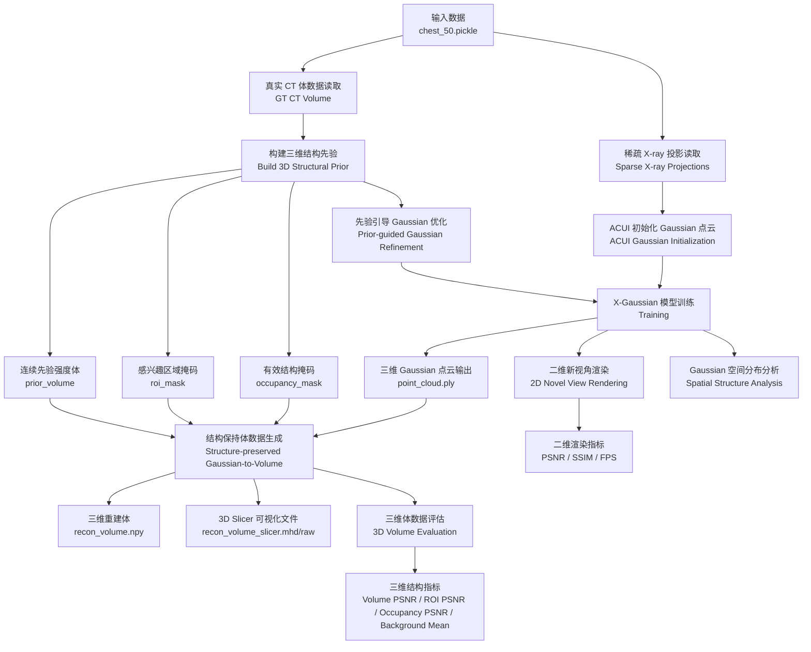

# X-Gaussian 项目阶段性进展汇报

## 1. 项目目标

本项目基于 X-Gaussian 框架，面向稀疏视角 X-ray/CT 场景，目标是在保持 2D 新视角合成质量的基础上，进一步提升 Gaussian 点云在三维空间中的结构合理性，并导出可用于观察和评估的 3D Volume。

当前项目重点不只是提升 2D 渲染指标，而是尝试让模型从二维投影监督中学习到更符合解剖结构分布的三维 Gaussian 表示，并进一步生成结构更清晰、背景杂质更少的 3D 体数据。

## 2. 当前整体流程

## 3. 已完成的主要工作

### 3.1 主创新点：重建先验引导的 Gaussian refinement

已在原始 X-Gaussian 基础上加入结构先验引导模块，主要包括：

- 从 CT volume 构建 `prior_data.npz`
- 生成 `occupancy_mask` 和 `roi_mask`
- ROI 区域引导 densification
- 空区域 Gaussian pruning
- 训练过程中的 Gaussian 空间分布分析

该部分目标是让 Gaussian 不是只追求 2D 投影拟合，而是在三维空间中更集中于有效结构区域。

### 3.2 副创新点 1：低分辨率 occupancy consistency loss

加入了 `L_occ`，将 Gaussian 分布映射到低分辨率体素网格，并与 prior occupancy 进行一致性约束。

该模块的作用是：

- 对 Gaussian 空间分布提供三维结构约束
- 引导 Gaussian 更靠近有效结构区域
- 避免完全依赖 2D 投影监督

从当前实验看，该模块对 2D PSNR 的提升不是特别明显，但作为结构正则项是合理的，没有破坏原模型训练。

### 3.3 副创新点 2：结构保持的 Gaussian-to-Volume 生成

原始 Gaussian 直接导出 volume 时，主要依赖 opacity 进行 splatting，容易出现：

- 有效结构不突出
- 背景或空区域存在杂质
- 3D Slicer 中显示效果较差

因此已加入 `structure_density` 导出模式。该模式不再只使用 opacity，而是结合：

- Gaussian opacity
- feature intensity
- Gaussian scale compactness
- ROI / occupancy prior
- prior volume intensity

最终输出：

- `recon_volume.npy`
- `recon_volume.mhd/raw`
- `recon_volume_slicer.mhd/raw`
- `preview_slices`
- `volume_metrics.json`

其中 `recon_volume_slicer.mhd/raw` 用于 3D Slicer 可视化。

## 4. 当前实验结果

### 4.1 2D 新视角合成结果

最终方法 30k 训练结果：

| Iteration | PSNR | SSIM | FPS | Gaussians |
|---:|---:|---:|---:|---:|
| 1000 | 30.02 | 0.9975 | 421.52 | 11984 |
| 2000 | 34.00 | 0.9989 | 347.39 | 50955 |
| 5000 | 38.04 | 0.9995 | 313.26 | 72622 |
| 10000 | 42.92 | 0.9998 | 303.70 | 101487 |
| 20000 | 45.55 | 0.9999 | 294.30 | 130909 |
| 30000 | 45.61 | 0.9999 | 300.66 | 130909 |

结论：

- 模型训练稳定。
- 2D 新视角合成指标较高。
- 20k 后基本收敛，30k 只带来小幅提升。

### 4.2 3D Volume 对比结果

| Method | Volume PSNR | Volume MAE | ROI PSNR | Occupancy PSNR | Outside ROI Mean |
|---|---:|---:|---:|---:|---:|
| Baseline 30k | 10.71 | 0.2175 | 6.37 | 3.95 | 0.0169 |
| Ours 30k | 11.40 | 0.1984 | 13.30 | 14.28 | 0.0040 |

主要提升：

- Volume PSNR: 10.71 -> 11.40，提升 0.69 dB
- Volume MAE: 0.2175 -> 0.1984，误差降低
- ROI PSNR: 6.37 -> 13.30，提升 6.93 dB
- Occupancy PSNR: 3.95 -> 14.28，提升 10.33 dB
- Outside ROI Mean: 0.0169 -> 0.0040，背景响应明显降低

结论：

当前方法对整体 3D Volume 有一定提升，对结构区域提升明显，尤其是 ROI 和 occupancy 区域。背景响应显著降低，说明结构保持导出模块可以有效减少无效区域杂质。

## 5. 当前项目价值判断

当前结果说明项目具备继续推进并整理成小论文的基础，原因如下：

1. 在 2D NVS 上，最终模型可以达到较高 PSNR / SSIM。
2. 在 3D Volume 上，相比 baseline，结构区域指标有明显提升。
3. 方法链路完整，包括 prior 构建、训练约束、Gaussian 分布分析、2D 渲染和 3D Volume 导出。
4. 有可解释的模块设计，而不是单纯堆实验。

更适合强调的论文贡献点是：

- 先验引导的 Gaussian 空间优化
- 低分辨率 occupancy consistency 结构约束
- 面向 CT 结构恢复的 Gaussian-to-Volume 导出

## 6. 目前需要注意的问题

1. 3D Volume 的整体 PSNR 仍然不高。

当前方法更偏向突出高密度结构和抑制背景，并不是完整恢复所有软组织强度。因此汇报时应强调结构区域恢复，而不是宣称已经实现高质量完整 CT 重建。

2. `prior` 来源需要说明清楚。

如果 prior 来自 GT volume，需要在汇报或论文中说明这是结构先验实验或 upper-bound prior。如果后续希望论文更严谨，建议尝试 FDK、NAF 或粗重建结果作为 prior 来源。

3. 需要补充可视化证据。

建议准备：

- baseline 2D render
- ours 2D render
- baseline 3D Slicer 截图
- ours 3D Slicer 截图
- ROI / occupancy 区域对比图
- volume 中心三切面对比图

## 7. 后续建议

短期建议：

- 整理 baseline 30k 与 ours 30k 的完整表格。
- 打包 2D renders、3D volume、metrics json、Slicer 截图。
- 加入 volume 小连通域过滤，进一步减少孤立杂质。

中期建议：

- 尝试不同 prior 来源，例如 FDK prior 或 NAF prior。
- 对比不同导出策略：baseline export、structure_preserved、structure_density。
- 增加 ablation study，分别去掉 ROI densify、empty prune、L_occ、structure_density。

## 8. 给老师汇报时的一句话总结

本项目已经完成从稀疏 X-ray 投影输入到 Gaussian 训练、2D 新视角合成、结构先验引导优化以及 3D Volume 导出的完整流程。当前方法在 2D NVS 上达到较高指标，并且相较 baseline 在 3D Volume 的 ROI 和 occupancy 结构区域有明显提升，说明该方向具备继续完善并整理成小论文的可行性。
